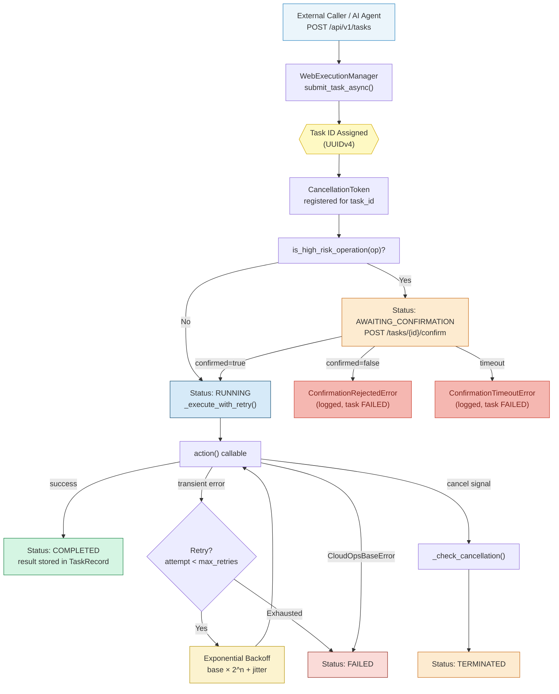
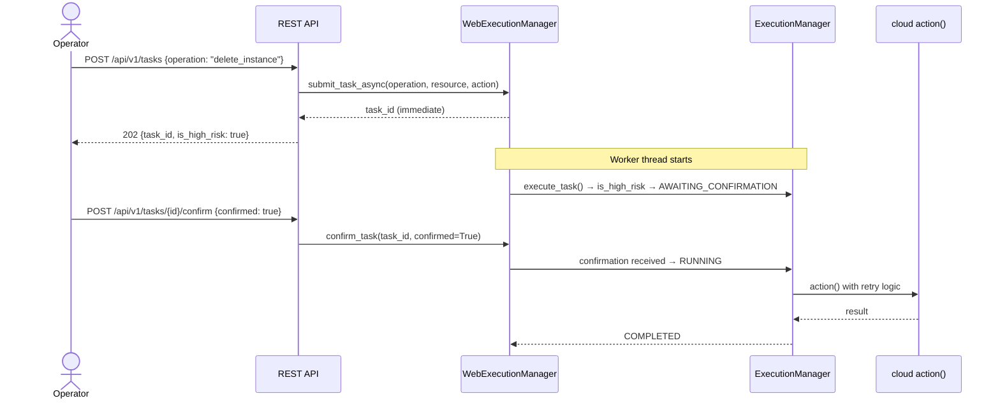
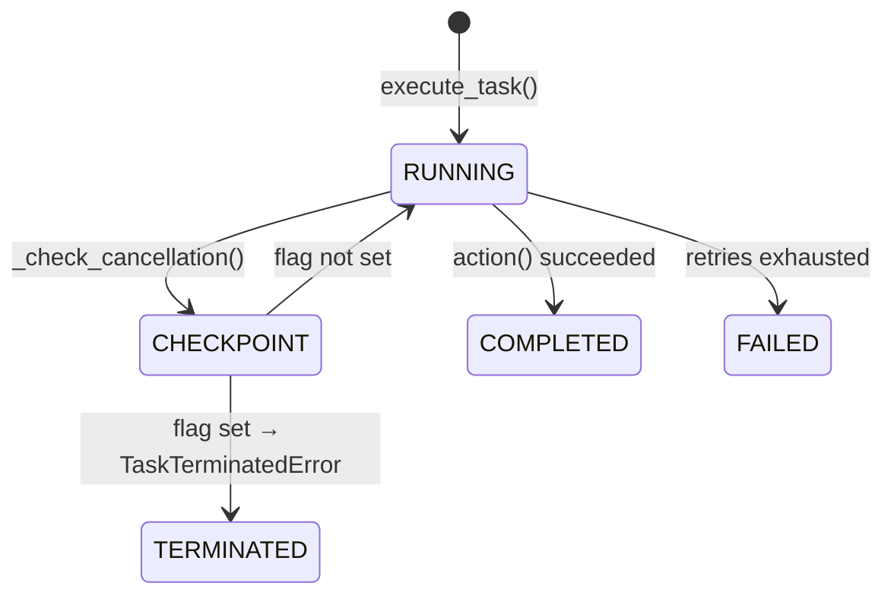
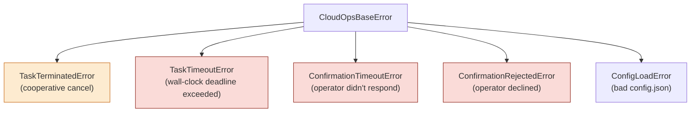

# cloud-ops-ai-agent

<div align="center">

[](https://github.com/citizen204/cloud-ops-ai-agent/actions/workflows/python-app.yml)
[](https://www.python.org/)
[](https://fastapi.tiangolo.com/)
[]()
[]()
[]()
[]()
[]()
[]()

<br/>

> **An industrial-grade cloud operations framework merging large-scale cloud-phone operational experience from Baidu with modern AI agent design patterns — exposed as a production-ready REST API.**

</div>

---

## Project Vision

`cloud-ops-ai-agent` is not just a task runner — it is a **safety-gated execution engine** designed around the operational realities of managing large-scale cloud infrastructure.

The architecture was directly informed by real-world engineering challenges encountered during an internship on **Baidu's Cloud-Phone (红手指) team**: How do you safely orchestrate destructive operations across a massive device fleet? How do you let an operator abort a running job mid-flight without data corruption? How do you make every configuration parameter tunable from a backend dashboard without a single code deploy?

This project fuses those hard-won lessons with a three-phase safety gateway, cooperative task cancellation, and a full REST API — producing a framework that is ready for both **production cloud operations** and **AI-augmented runbook automation**.

```
Baidu Cloud-Phone Scale Ops  ──►  Safety-Gated Engine  ──►  REST API / AI Agent Interface
   (10,000+ devices)               (Threading + Safety)       (FastAPI + WebExecutionManager)
```

---

## Project Structure

```
cloud-ops-ai-agent/
├── config.json                          # Operational configuration (risk levels, timeouts)
├── requirements.txt                     # Production dependencies
├── dev-requirements.txt                 # Dev / CI dependencies (pytest, flake8)
├── Dockerfile                           # Container image
├── docker-compose.yml                   # One-command deployment
├── cloud_ops_ai_agent/
│   ├── __init__.py                      # Public package API
│   ├── execution_manager.py             # Core ExecutionManager + ManagerConfig
│   ├── exceptions.py                    # Typed exception hierarchy
│   ├── web_execution_manager.py         # HTTP-adapted manager (event-driven confirm)
│   ├── mock_operations.py               # Simulated cloud ops (dev / demo)
│   └── api/
│       ├── main.py                      # FastAPI application
│       └── schemas.py                   # Pydantic request/response models
└── tests/
    └── test_execution_manager.py        # 19 unit tests (all passing)
```

---

## Request Lifecycle: End-to-End Flow

> How does a single operation travel through the engine — from the moment an operator (or AI agent) submits a request, to the final audited result?



---

## Key Architectural Features

### 1. Three-Phase Safety Gateway

Before any state-changing operation executes, it is classified against a config-driven risk list. High-risk operations pause in `AWAITING_CONFIRMATION` state; a second HTTP call from the operator (or AI agent) delivers the approval or rejection.



| State | Trigger | Next step |
|---|---|---|
| `PENDING` | Task submitted | Immediately transitions to next state |
| `AWAITING_CONFIRMATION` | Operation is high-risk | `POST /tasks/{id}/confirm` required |
| `RUNNING` | Confirmed (or safe op) | Executes with retry logic |
| `COMPLETED` | Action succeeded | Result available via `GET /tasks/{id}` |
| `TERMINATED` | `DELETE /tasks/{id}` called | Cooperative cancel at next checkpoint |
| `FAILED` | Rejected / timeout / exhausted retries | Error stored in `TaskRecord` |

---

### 2. Cooperative Graceful Termination

Long-running operations must be stoppable mid-flight without leaving resources in an inconsistent state. The engine uses a `threading.Event`-based cancel flag, checked at every retry boundary:

```python
for attempt in range(1, max_attempts + 1):
    self._check_cancellation(task_id)   # raises TaskTerminatedError if flagged
    try:
        return action()
    except Exception:
        ...  # retry with backoff
```

Sending `DELETE /api/v1/tasks/{task_id}` sets the flag; the worker thread honours it at its next checkpoint — never mid-operation, always at a safe boundary.



---

### 3. Zero-Hardcoding Configuration (`ManagerConfig`)

Every operational parameter lives in `config.json` and is parsed once at startup into a **frozen, immutable dataclass** — preventing accidental runtime mutation.

```python
@dataclass(frozen=True)
class ManagerConfig:
    high_risk_operations: frozenset[str]   # immutable set — no accidental .add()
    confirmation_timeout_seconds: int
    max_retries: int
    retry_delay_seconds: float
    task_timeout_seconds: float
```

To promote `restart_instance` to high-risk in production, update `config.json` and restart the service — **no code change, no redeploy**.

---

### 4. Industrial-Grade Retry with Jitter

Every `action()` is wrapped with exponential back-off retry logic. The ±10% per-attempt jitter prevents correlated retries across concurrent tasks (the **thundering-herd problem**):

```
delay(n) = retry_delay_seconds × 2^(n-1) × (1 + 0.1 × rand)
```

| Exception type | Behaviour |
|---|---|
| Any non-`CloudOpsBaseError` exception | Retried up to `max_retries` times |
| `CloudOpsBaseError` subclass | Propagates immediately — never retried |
| `TaskTerminatedError` | Propagates immediately — cooperative abort honoured |
| Deadline exceeded | Raises `TaskTimeoutError` — no further retries |

---

### 5. Task Timeout Enforcement

`task_timeout_seconds` (previously loaded from config but never enforced) now acts as a hard wall-clock deadline across all retry attempts:

```python
deadline = time.monotonic() + self.config.task_timeout_seconds
for attempt in range(1, max_attempts + 1):
    if time.monotonic() >= deadline:
        raise TaskTimeoutError(task_id=task_id, timeout_seconds=timeout)
    ...
```

---

## REST API Reference

The `WebExecutionManager` adapts the synchronous safety pipeline to an async HTTP context. Tasks run in a thread pool; the API never blocks waiting for completion.

| Method | Endpoint | Description |
|---|---|---|
| `GET` | `/health` | Liveness check + config summary |
| `GET` | `/api/v1/operations` | List available operations with risk classification |
| `POST` | `/api/v1/tasks` | Submit a cloud operation |
| `GET` | `/api/v1/tasks` | List all submitted tasks |
| `GET` | `/api/v1/tasks/{task_id}` | Get task status and result |
| `POST` | `/api/v1/tasks/{task_id}/confirm` | Approve or reject a high-risk task |
| `DELETE` | `/api/v1/tasks/{task_id}` | Send cooperative termination signal |

Interactive docs available at **`/docs`** (Swagger UI) and **`/redoc`** once the server is running.

---

## Quick Start

### Option A — Docker (recommended)

```bash
git clone https://github.com/citizen204/cloud-ops-ai-agent.git
cd cloud-ops-ai-agent

docker-compose up
# API available at http://localhost:8000
# Docs at        http://localhost:8000/docs
```

### Option B — Local Python

```bash
pip install -r requirements.txt
uvicorn cloud_ops_ai_agent.api.main:app --reload
```

### Example: Submit and confirm a high-risk operation

```bash
# 1. Submit the task
curl -X POST http://localhost:8000/api/v1/tasks \
  -H "Content-Type: application/json" \
  -d '{"operation": "delete_instance", "resource": "prod-vm-42",
       "params": {"instance_id": "vm-prod-01"}}'
# → {"task_id": "abc-123", "is_high_risk": true, "status": "PENDING", ...}

# 2. Approve it
curl -X POST http://localhost:8000/api/v1/tasks/abc-123/confirm \
  -H "Content-Type: application/json" \
  -d '{"confirmed": true}'

# 3. Poll the result
curl http://localhost:8000/api/v1/tasks/abc-123
# → {"status": "COMPLETED", "result": {"status": "DELETED", ...}}
```

### Example: Programmatic usage (Python)

```python
from cloud_ops_ai_agent import ExecutionManager

manager = ExecutionManager(config_path="config.json")

# Safe operation — runs immediately
manager.execute_task(
    operation="list_instances",
    resource="us-central1",
    action=lambda: print("listing…"),
)

# High-risk operation — pauses for stdin confirmation
manager.execute_task(
    operation="delete_instance",
    resource="prod-vm-42",
    action=lambda: cloud_client.delete("prod-vm-42"),
)
# → [HIGH RISK] Operation 'delete_instance' on resource 'prod-vm-42'
#   requires confirmation. Type 'CONFIRM' to proceed:
```

---

## Exception Hierarchy



---

## Configuration Reference (`config.json`)

| Key | Description |
|---|---|
| `high_risk_operations` | Operations that trigger the confirmation workflow |
| `confirmation.timeout_seconds` | Seconds to wait for operator confirmation before aborting |
| `confirmation.confirm_token` | Exact string the operator must type (CLI mode) |
| `execution.max_retries` | Retry attempts on transient failures |
| `execution.retry_delay_seconds` | Base delay between retries (doubles each attempt + jitter) |
| `execution.task_timeout_seconds` | Hard wall-clock deadline for any single task |

---

## How It Aligns with My Baidu Cloud-Phone Internship

The architectural decisions in this codebase map directly to engineering work delivered during the Baidu 红手指 (Cloud-Phone) internship:

| Code Module | Internship Deliverable |
|---|---|
| `CancellationToken` / `terminate_task()` | **任务中止按钮及确认流程** — Designed the operator-facing abort UI and cooperative termination contract that prevented partial device-state corruption during rolling updates |
| `ManagerConfig` + `config.json` + `frozen=True` | **功能说明可配置化 / 后台可配置方案** — Moved hardcoded operational parameters into a backend-editable configuration layer, enabling ops teams to tune behaviour without code deployments |
| `request_confirmation()` / `confirm_task()` | **账号安全体系与验证机制** — Implemented the double-confirmation (二次确认) guard for destructive operations, adapted here to both CLI (stdin) and HTTP (REST API) confirmation flows |
| Retry with jitter in `_execute_with_retry()` | **大规模并发环境下的鲁棒性** — Contributed to the retry layer that shielded upstream device APIs from thundering-herd retries during batch reboots |

---

## Roadmap

- [x] **Safety Gateway** — config-driven high-risk classification with confirmation workflow
- [x] **Cooperative Cancellation** — `threading.Event` cancel flag checked at every retry boundary
- [x] **REST API** — FastAPI HTTP layer with `WebExecutionManager` (async confirm/terminate)
- [x] **Task Timeout Enforcement** — wall-clock deadline raises `TaskTimeoutError`
- [x] **Retry Jitter** — thundering-herd mitigation with ±10% per-attempt randomisation
- [x] **Immutable Config** — `frozen=True` dataclasses prevent accidental runtime mutation
- [x] **Docker Deployment** — `Dockerfile` + `docker-compose.yml` for one-command startup
- [ ] **OpenTelemetry Spans** — propagate `trace_id` as OTLP context for distributed tracing
- [ ] **Circuit Breaker** — per-operation breaker to halt retries during downstream outages
- [ ] **RAG Integration** — inject runbook context into task dispatch for AI-guided operation selection

---

## Running Tests

```bash
pip install -r dev-requirements.txt
pytest tests/ -v
# 19 passed
```

---

## License

MIT © 2026 — Built on patterns from Baidu Cloud-Phone (红手指) scalable operations infrastructure.
