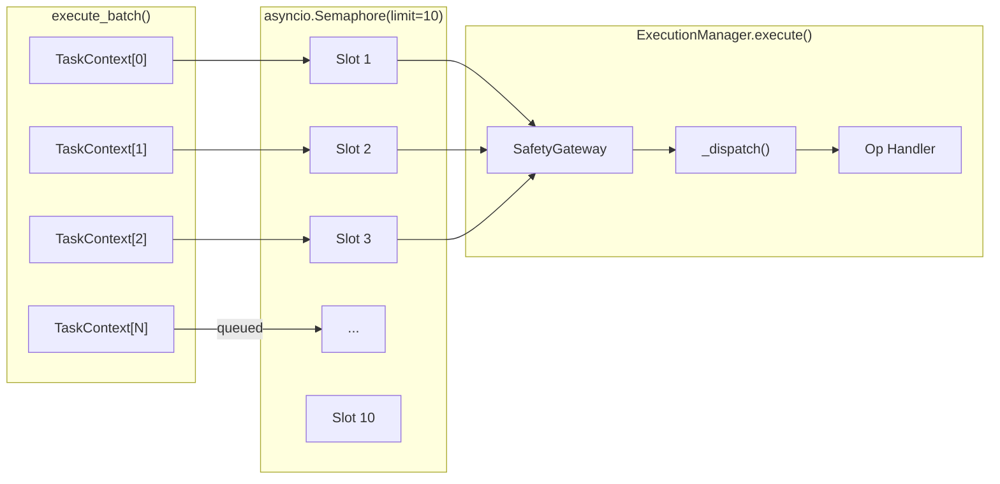
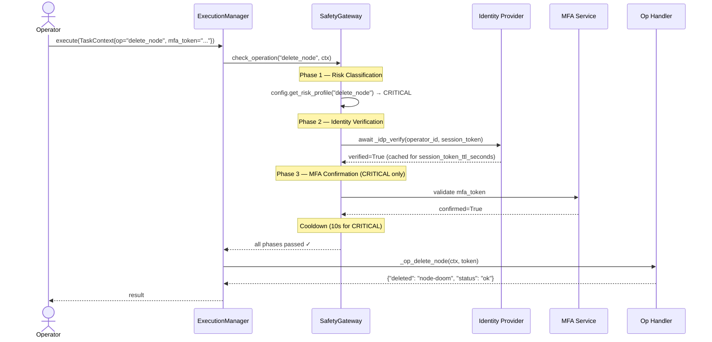
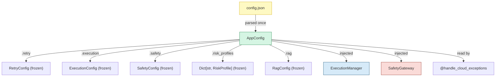
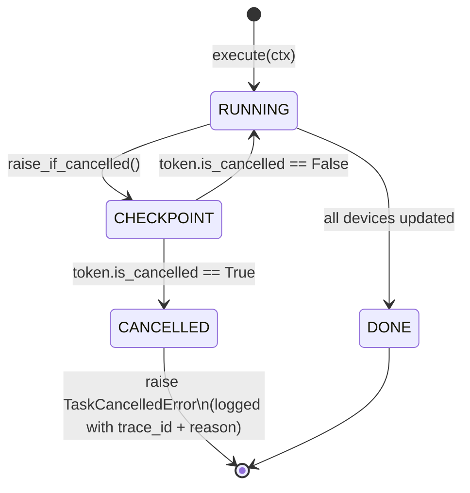
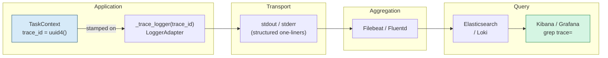
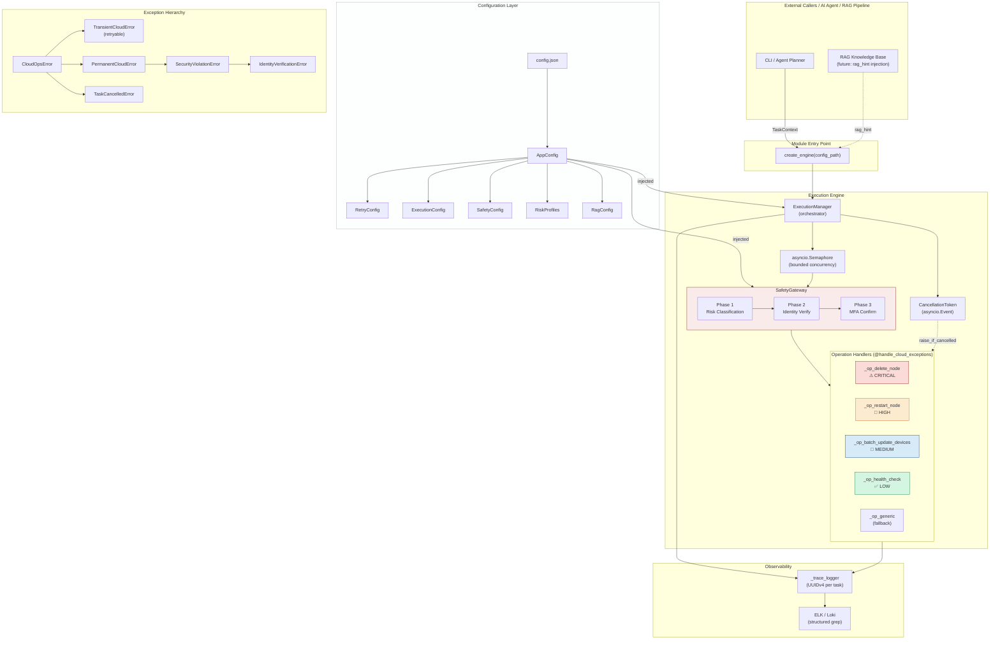

# cloud-ops-ai-agent

<div align="center">

[](https://www.python.org/)
[](https://docs.python.org/3/library/asyncio.html)
[]()
[]()
[]()
[]()
[]()
[]()

<br/>

> **An experimental framework merging large-scale cloud-phone operational experience from Baidu with modern async AI agent design patterns.**

</div>

---

## Project Vision

`cloud-ops-ai-agent` is not just a task runner — it is an **industrial-grade async execution engine** designed around the operational realities of managing thousands of concurrent virtual devices at scale.

The architecture was directly informed by real-world engineering challenges encountered during an internship on **Baidu's Cloud-Phone (红手指) team**: How do you safely orchestrate destructive operations across a massive device fleet? How do you let an operator abort a rolling update mid-flight without data corruption? How do you make every configuration parameter tunable from a backend dashboard without a single code deploy?

This project fuses those hard-won lessons with modern Python asyncio primitives, a three-phase cryptographic safety gateway, and a RAG-ready documentation contract — producing a framework that is ready for both **production cloud operations** and **AI-augmented runbook automation**.

```
Baidu Cloud-Phone Scale Ops  ──►  Async Python Engine  ──►  AI Agent Interface
   (10,000+ devices)               (asyncio + Safety)        (RAG-augmented)
```

---

## Key Architectural Features

### 1. Bounded Concurrency via `asyncio.Semaphore`

Managing a fleet of virtual phones means launching dozens of operations simultaneously. Unbounded parallelism saturates the orchestration host and causes cascading failures. The engine solves this with a **config-driven semaphore** that creates a precise ceiling on concurrent task slots.

```python
# Concurrency limit sourced exclusively from config.json — never hard-coded
self._semaphore = asyncio.Semaphore(config.execution.batch_concurrency_limit)

async def _run_one(idx: int, ctx: TaskContext) -> None:
    async with self._semaphore:   # blocks here if the slot pool is full
        outcome = await self.execute(ctx)
```

When `batch_concurrency_limit = 10` (as configured), the 11th device operation queues transparently behind an active slot. This ensures:

- **No thread-pool exhaustion** — all I/O is non-blocking within the event loop.
- **Predictable memory footprint** — at most N tasks hold open connections simultaneously.
- **Back-pressure propagation** — slowdowns in the target API naturally throttle the batch rate.



---

### 2. Three-Phase Safety Gateway

The `SafetyGateway` is the security backbone of the engine, directly modelled on the **account-security and verification mechanisms** designed during the Baidu Cloud-Phone internship. Before any state-changing operation reaches an execution handler, it must pass all applicable phases in strict order.



| Phase | Trigger | Action on Failure |
|---|---|---|
| **1 — Risk Classification** | Every operation | Defaults to `HIGH`; raises `SecurityViolationError` if policy explicitly blocks |
| **2 — Identity Verification** | `HIGH` + `CRITICAL` ops | Raises `IdentityVerificationError`; op never executed |
| **3 — MFA Confirmation** | `CRITICAL` ops only | Raises `IdentityVerificationError` if `mfa_token` absent or invalid |

> A session-verification cache (`trace_id → verified_at`) prevents redundant IdP round-trips within the same task's TTL window, balancing security with performance under high-concurrency batch workloads.

---

### 3. Zero-Hardcoding Configuration (`AppConfig`)

Every numerical constant — retry limits, backoff delays, concurrency caps, operation risk classifications, RAG thresholds — lives in a single `config.json` and is parsed once at startup into **frozen, immutable dataclasses**.

```python
@dataclass(frozen=True)      # immutable after construction — prevents accidental mutation
class RetryConfig:
    max_attempts: int
    base_backoff_seconds: float
    max_backoff_seconds: float
    backoff_multiplier: float
    jitter_factor: float
```

`AppConfig` is constructed once and injected into every component. No component ever reads a file or accesses an environment variable directly — they receive a typed, validated configuration object through their constructor.



To change the retry policy in production, an operator updates `config.json` and restarts the engine — **no code change, no redeploy of business logic**.

---

### 4. Cooperative Graceful Termination (`CancellationToken`)

Long-running batch operations — like rolling out a firmware update to 10,000 cloud-phone instances — must be stoppable mid-flight without leaving devices in an inconsistent state.

The engine implements this via `CancellationToken`, a cooperative abort mechanism backed by `asyncio.Event`. An operator signals cancellation through `ExecutionManager.cancel_task(trace_id)`; the running coroutine checks the signal at every logical checkpoint via `token.raise_if_cancelled()`.

```python
for device_id in device_ids:
    token.raise_if_cancelled()          # high-frequency cancellation_point

    tlog.info("  Updating device '%s' …", device_id)
    await asyncio.sleep(interval)       # non-blocking per-device API call
    updated.append(device_id)
```

There is **no `asyncio.Task.cancel()` involved** — the coroutine always reaches a clean checkpoint before raising `TaskCancelledError`. This mirrors the **task-abort confirmation UX** from Baidu's Cloud-Phone management console, where a single abort button gracefully drains the current sub-operation before halting.



---

### 5. Industrial-Grade Retry: `@handle_cloud_exceptions`

A single decorator wraps every operation handler with full retry semantics, sourcing all parameters from `self._config.retry` at call time.

```
delay(attempt) = min(base × multiplier^(attempt-1), max_backoff) + jitter
```

Where `jitter = delay × jitter_factor × random()` — drawn uniformly per attempt to prevent retry storms across concurrent batch tasks (the **thundering-herd problem**).

| Exception Type | Behaviour |
|---|---|
| `TransientCloudError` | Retried up to `max_attempts` with exponential backoff |
| `PermanentCloudError` | Propagates immediately — never retried |
| `TaskCancelledError` | Propagates immediately — cooperative abort honoured |
| `asyncio.CancelledError` | Re-raised — event-loop contract preserved |
| Any other `Exception` | Wrapped in `PermanentCloudError` + logged with full traceback |

---

## Observability: TraceID Full-Chain Tracing

Every task is assigned a **UUIDv4 `trace_id`** at `TaskContext` creation time. This ID propagates through every log line emitted during that task's lifecycle — from gateway phases to retry attempts to final audit records.

```
2026-03-05 11:10:20,662 | INFO  | trace=f6540d51-5c00-4e2a-8820-71e5ef062e1c | SafetyGateway | Phase 1 complete | op='delete_node' risk='critical'
2026-03-05 11:10:20,714 | INFO  | trace=f6540d51-5c00-4e2a-8820-71e5ef062e1c | SafetyGateway | Phase 2 passed — identity verified.
2026-03-05 11:10:20,766 | INFO  | trace=f6540d51-5c00-4e2a-8820-71e5ef062e1c | SafetyGateway | Phase 3 passed — MFA confirmed.
2026-03-05 11:10:30,971 | INFO  | trace=f6540d51-5c00-4e2a-8820-71e5ef062e1c | Op            | Node 'node-doom' deleted successfully.
2026-03-05 11:10:30,971 | INFO  | trace=f6540d51-5c00-4e2a-8820-71e5ef062e1c | Engine        | TASK DONE | elapsed_ms=10309.1
```

A single `grep trace=f6540d51` in Kibana or Grafana Loki reconstructs the **entire operation timeline** — across gateway phases, retries, and the final result — with no additional instrumentation required.



**Batch operations** use a secondary `batch_id` (8-char UUID prefix) so you can query either the batch-level summary or any individual task within it.

---

## How It Aligns with My Baidu Cloud-Phone Internship

The architectural decisions in this codebase map directly to engineering work delivered during the Baidu 红手指 (Cloud-Phone) internship:

| Code Module | Internship Deliverable | Evidence |
|---|---|---|
| `CancellationToken` + `raise_if_cancelled()` | **任务中止按钮及确认流程** — Designed the operator-facing abort UI and the backend cooperative termination contract that prevented partial device-state corruption during rolling updates | `_op_batch_update_devices` inserts a checkpoint before every device; abort is honoured within one `cancellation_check_interval_seconds` |
| `AppConfig` + `config.json` + `@dataclass(frozen=True)` | **功能说明可配置化 / 后台可配置方案** — Moved hardcoded operational parameters (timeouts, retry counts, risk thresholds) into a backend-editable configuration layer, enabling ops teams to tune behaviour without code deployments | All 5 sub-configs (`RetryConfig`, `ExecutionConfig`, `SafetyConfig`, `RiskProfile`, `RagConfig`) are frozen dataclasses sourced entirely from `config.json` |
| `SafetyGateway` (Phase 2 + Phase 3) | **账号安全体系与验证机制** — Implemented the identity-verification and MFA challenge flow that gates destructive account operations (session invalidation, privilege escalation) on the Cloud-Phone platform | Phase 2 calls `_idp_verify` with session-cache TTL; Phase 3 enforces `mfa_token` presence for `CRITICAL` risk ops; `IdentityVerificationError` is non-retryable |
| `@handle_cloud_exceptions` + `TransientCloudError` | **大规模并发环境下的鲁棒性** — Contributed to the retry and circuit-breaker layer that shielded upstream device APIs from thundering-herd retries during batch reboots | Exponential backoff with per-attempt jitter prevents correlated retries across concurrent batch tasks |
| `TraceID` + `_trace_logger` | **可追溯性 / 操作审计** — Established structured log correlation for multi-device operations, enabling post-incident tracing across thousands of simultaneous sessions | Every log line carries `trace=<uuid4>`, directly queryable in ELK without additional APM instrumentation |

---

## Complete System Architecture



---

## Quick Start

```bash
# Clone and navigate
git clone https://github.com/your-handle/cloud-ops-ai-agent.git
cd cloud-ops-ai-agent

# Install dependencies (Python 3.11+ required)
pip install -r requirements.txt

# Run the built-in smoke test (validates full pipeline end-to-end)
python execution_manager.py
```

**Example: Programmatic usage**

```python
import asyncio
from execution_manager import create_engine, TaskContext

async def main():
    engine = create_engine()          # reads config.json automatically

    # LOW risk — no verification required
    result = await engine.execute(
        TaskContext(
            operation="health_check",
            operator_id="sre-alice",
            session_token="<bearer-token>",
        )
    )

    # CRITICAL risk — identity + MFA required
    result = await engine.execute(
        TaskContext(
            operation="delete_node",
            payload={"node_id": "node-007"},
            operator_id="admin-bob",
            session_token="<bearer-token>",
            mfa_token="<totp-code>",
        )
    )

asyncio.run(main())
```

---

## Configuration Reference

All tunables live in `config.json`. Key sections:

| Section | Key Fields | Purpose |
|---|---|---|
| `execution` | `batch_concurrency_limit`, `cancellation_check_interval_seconds` | Semaphore size; abort checkpoint frequency |
| `retry` | `max_attempts`, `base_backoff_seconds`, `backoff_multiplier`, `jitter_factor` | Exponential backoff policy |
| `safety_gateway` | `identity_verification_timeout_seconds`, `session_token_ttl_seconds` | IdP call timeout; session cache TTL |
| `risk_levels` | Per-level `operations[]`, `requires_identity_verification`, `requires_mfa` | Operation classification and gate policy |
| `rag_integration` | `enabled`, `knowledge_base_url`, `top_k_results` | Future RAG context injection |

---

## Roadmap

- [ ] **RAG Integration** — Inject `rag_hint` context from a vector knowledge base into `TaskContext` before dispatch, enabling AI-guided operation selection and parameter validation.
- [ ] **Circuit Breaker** — Wrap each operation handler with a per-target circuit breaker to prevent retries from amplifying a downstream outage.
- [ ] **Prometheus Metrics** — Expose `tasks_total`, `task_duration_seconds`, `safety_violations_total` as Prometheus counters/histograms.
- [ ] **OpenTelemetry Spans** — Propagate `trace_id` as an OTLP trace context for distributed tracing across microservice boundaries.
- [ ] **gRPC Transport Adapter** — Replace mock `_idp_verify` and `_op_*` stubs with real gRPC service bindings.

---

## License

MIT © 2026 — Built on patterns from Baidu Cloud-Phone (红手指) scalable operations infrastructure.
