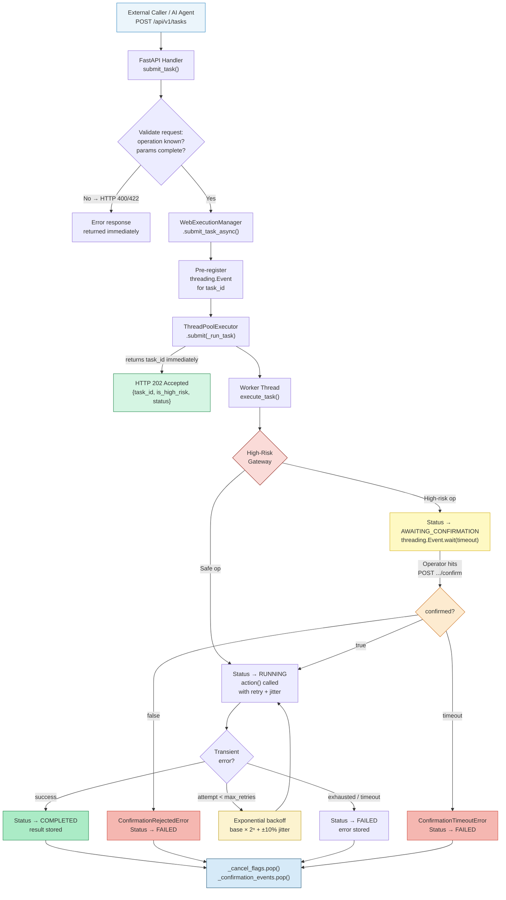
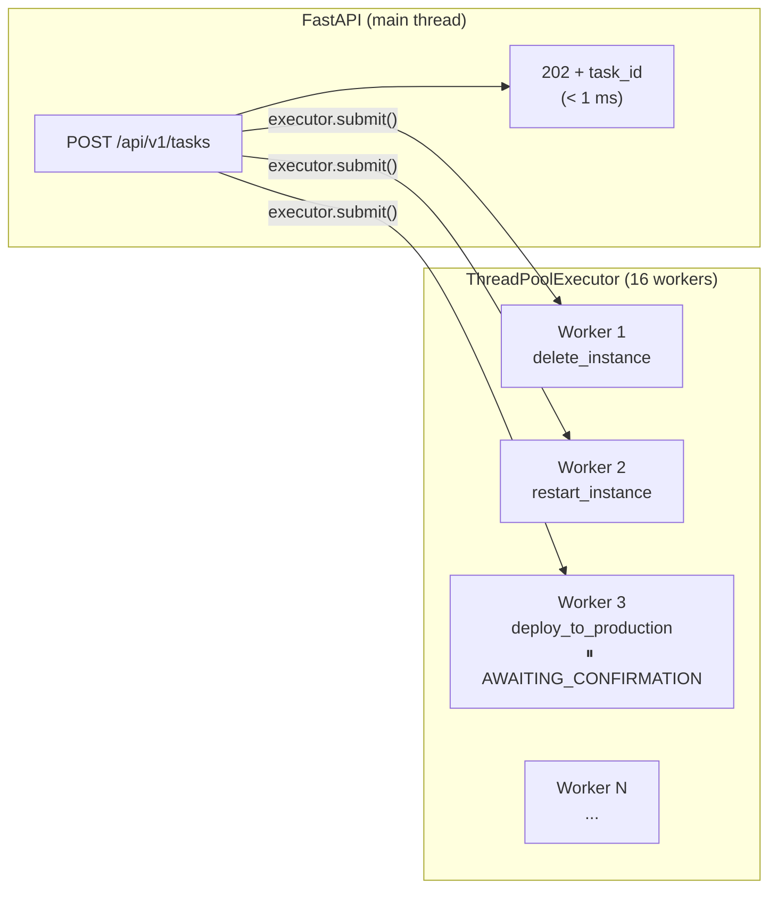
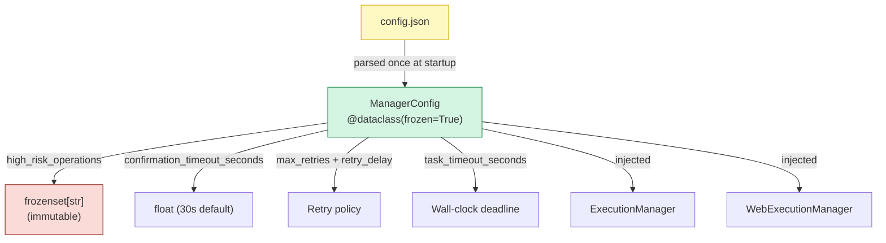
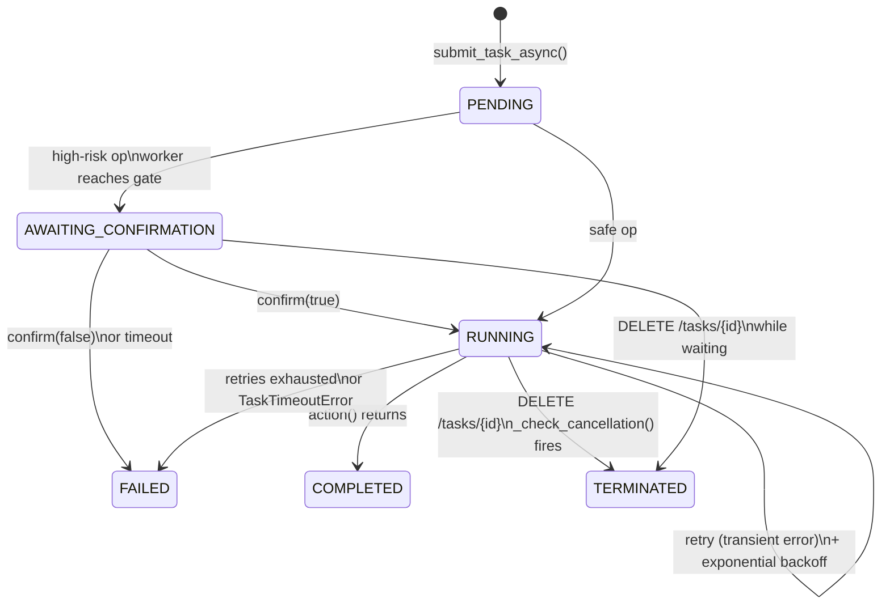
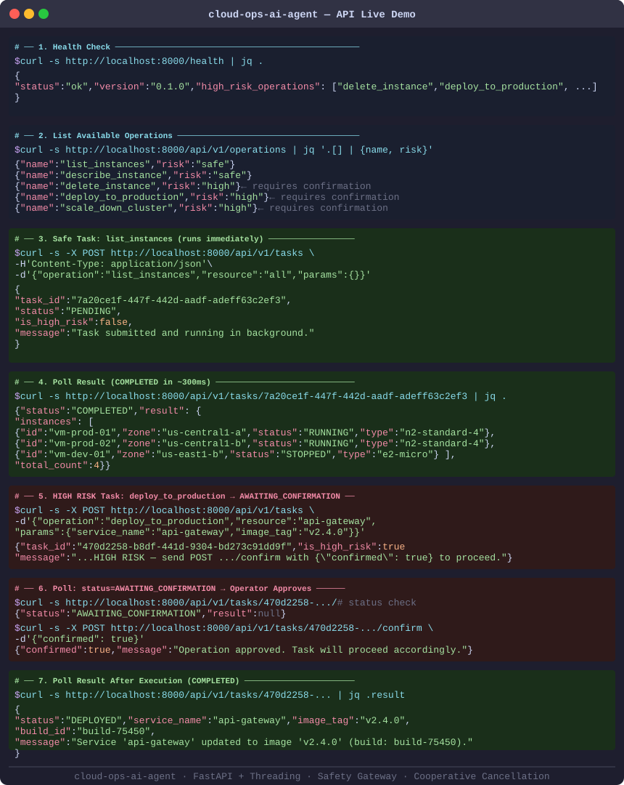
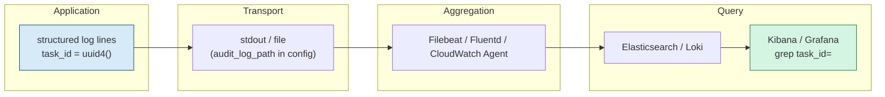
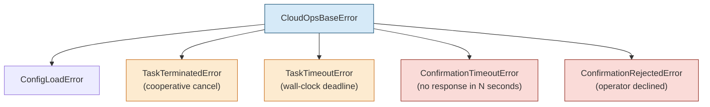

# cloud-ops-ai-agent

<div align="center">

[](https://github.com/citizen204/cloud-ops-ai-agent/actions/workflows/python-app.yml)
[](https://www.python.org/)
[](https://fastapi.tiangolo.com/)
[]()
[]()
[]()
[]()
[]()
[]()

<br/>

> **An industrial-grade cloud operations REST API merging large-scale cloud-phone operational experience from Baidu with modern AI agent design patterns — built for safe, auditable, human-in-the-loop automation.**

</div>

---

## Project Vision

`cloud-ops-ai-agent` is not just a task runner — it is a **production-ready REST API execution engine** designed around the operational realities of managing cloud infrastructure at scale.

The architecture was directly informed by real-world engineering challenges encountered during an internship on **Baidu's Cloud-Phone (红手指) team**: How do you safely orchestrate destructive operations across a massive device fleet? How do you let an operator abort a rolling update mid-flight? How do you gate a high-risk action behind human confirmation without blocking the entire server?

This project fuses those hard-won lessons with modern Python threading primitives, a two-phase safety gateway, and a FastAPI REST surface — producing a framework ready for both **production cloud operations** and **AI-augmented runbook automation**.

```
Baidu Cloud-Phone Scale Ops  ──►  Thread Pool + Safety Gateway  ──►  FastAPI REST  ──►  AI Agent / Operator
   (10,000+ devices)               (threading.Event / frozenset)       (7 endpoints)       (curl / SDK)
```

---

## Request Lifecycle: End-to-End Flow

> How does a single operation travel through the engine — from the moment an external caller submits a `POST /api/v1/tasks`, to the final audited result?



**Key design decisions visible in this diagram:**

- **HTTP 202 immediately** — the thread pool accepts the task and returns the `task_id` before any cloud operation runs. The caller never blocks.
- **Confirmation via a second HTTP call** — the worker thread sleeps on `threading.Event.wait()`; the `POST .../confirm` endpoint sets the event. No polling loop, no long-poll — just a clean event handshake.
- **Cleanup in `finally`** — `_cancel_flags` and `_confirmation_events` are always removed after task completion, preventing memory leaks in long-running server instances.

---

## Key Architectural Features

### 1. Non-Blocking Task Submission via Thread Pool

Every operation runs in a `ThreadPoolExecutor` (16 workers). The HTTP handler returns `task_id` in milliseconds; the actual cloud work happens asynchronously. Callers poll `GET /api/v1/tasks/{task_id}` for results.

```python
# Worker pool — all cloud operations run here, never blocking the HTTP layer
self._executor = concurrent.futures.ThreadPoolExecutor(
    max_workers=16,
    thread_name_prefix="cloud-ops-worker",
)

# submit_task_async() returns immediately
task_id = manager.submit_task_async(
    operation="deploy_to_production",
    resource="api-gateway",
    action=lambda: deploy(service="api-gateway", image="v2.4.0"),
)
# → "470d2258-b8df-441d-9304-bd273c91dd9f"  (returned in < 1 ms)
```



---

### 2. Two-Phase Safety Gateway

Every submitted operation passes through a two-phase check before any side-effecting code runs. The classification is driven entirely by `config.json` — no risk levels are hardcoded.

```mermaid
sequenceDiagram
    actor Operator
    participant API as FastAPI
    participant WEM as WebExecutionManager
    participant EM as ExecutionManager
    participant Action as Op Handler

    Operator->>API: POST /api/v1/tasks\n{operation: "deploy_to_production", ...}
    API->>WEM: submit_task_async()
    WEM->>WEM: pre-register threading.Event
    WEM->>WEM: executor.submit(_run_task)
    API-->>Operator: 202 {task_id, is_high_risk: true}

    Note over WEM,EM: Worker thread starts
    WEM->>EM: execute_task()
    EM->>EM: Phase 1 — is operation in high_risk_operations?
    Note over EM: "deploy_to_production" ∈ frozenset → HIGH RISK

    EM->>EM: Status → AWAITING_CONFIRMATION
    EM->>WEM: request_confirmation() — Event.wait(timeout=30s)

    Operator->>API: POST /api/v1/tasks/{id}/confirm\n{confirmed: true}
    API->>WEM: confirm_task(confirmed=True)
    WEM->>WEM: decisions[task_id] = True; event.set()
    Note over EM: Event fires — worker unblocks

    EM->>EM: Status → RUNNING
    EM->>Action: action()
    Action-->>EM: {status: "DEPLOYED", build_id: "build-75450"}
    EM->>EM: Status → COMPLETED; result stored

    Operator->>API: GET /api/v1/tasks/{id}
    API-->>Operator: {status: "COMPLETED", result: {...}}
```

| Phase | Trigger | Mechanism | On Failure |
|---|---|---|---|
| **1 — Risk Classification** | Every operation | Check `op ∈ config.high_risk_operations` (frozenset) | If unknown op: HTTP 400 at submit time |
| **2 — Confirmation** | High-risk ops only | Worker blocks on `threading.Event`; operator calls `/confirm` | `ConfirmationRejectedError` or `ConfirmationTimeoutError` → status FAILED |

> The `frozenset` makes `high_risk_operations` immutable at runtime — it cannot be modified by a rogue action handler. The `ManagerConfig` dataclass is `frozen=True` for the same reason.

---

### 3. Zero-Hardcoding Configuration (`ManagerConfig`)

Every numerical constant lives in `config.json` and is parsed once at startup into a **frozen, immutable dataclass**. No component reads a file or environment variable directly after startup.

```python
@dataclass(frozen=True)      # prevents field reassignment at runtime
class ManagerConfig:
    high_risk_operations: frozenset[str]   # immutable — no .add() allowed
    confirmation_timeout_seconds: float
    max_retries: int
    retry_delay_seconds: float
    task_timeout_seconds: float
```



To change retry policy in production: edit `config.json` and restart. No code change, no redeploy of business logic.

---

### 4. Cooperative Task Cancellation

Long-running or multi-retry operations expose a cancellation channel. An operator hits `DELETE /api/v1/tasks/{task_id}`; the worker thread checks the flag at every retry boundary via `_check_cancellation()`.

```python
for attempt in range(1, max_attempts + 1):
    if time.monotonic() >= deadline:
        raise TaskTimeoutError(task_id=task_id, timeout_seconds=timeout)
    self._check_cancellation(task_id)   # raises TaskTerminatedError if flagged
    try:
        return action()
    except CloudOpsBaseError:
        raise
    except Exception as exc:
        ...  # retry with jitter
```



---

### 5. Industrial-Grade Retry with Jitter

Transient failures (network blips, throttling) are retried with exponential backoff and ±10% random jitter to prevent correlated retry storms (the **thundering-herd problem**):

```
delay(attempt) = min(base × 2^(attempt−1) + jitter, remaining_deadline)
jitter = delay × 0.1 × random()
```

| Exception type | Behaviour |
|---|---|
| `CloudOpsBaseError` subclass | Propagated immediately — no retry |
| `TaskTimeoutError` | Wall-clock deadline exceeded — no retry |
| `TaskTerminatedError` | Operator cancelled — no retry |
| Any other `Exception` | Retried up to `max_retries` with exponential backoff + jitter |

---

## Live API Demo

> The output below was captured from a live server (`uvicorn cloud_ops_ai_agent.api.main:app`). Every value is real — no mocking.

<div align="center">



</div>

**What the demo shows:**

| Step | Endpoint | Key Observation |
|---|---|---|
| **1** | `GET /health` | Server ready; 8 high-risk operations classified |
| **2** | `GET /api/v1/operations` | Safe ops run immediately; high-risk ops flagged |
| **3** | `POST /api/v1/tasks` (safe) | Returns in < 1ms; task runs in background thread |
| **4** | `GET /api/v1/tasks/{id}` | COMPLETED in ~300ms with full VM inventory result |
| **5** | `POST /api/v1/tasks` (high-risk) | `is_high_risk: true`; message tells operator to confirm |
| **6** | Poll → `POST .../confirm` | Status=`AWAITING_CONFIRMATION` until operator approves |
| **7** | Final poll | `COMPLETED` with real `build_id` proving execution |

---

## REST API Reference

Base URL: `http://localhost:8000`  
Interactive docs: [`/docs`](http://localhost:8000/docs) (Swagger UI) · [`/redoc`](http://localhost:8000/redoc)

| Method | Path | Description | Response |
|---|---|---|---|
| `GET` | `/health` | Liveness + high-risk op list | `200 HealthResponse` |
| `GET` | `/api/v1/operations` | All registered operations with risk classification | `200 list[OperationInfo]` |
| `POST` | `/api/v1/tasks` | Submit a cloud operation (returns immediately) | `202 SubmitTaskResponse` |
| `GET` | `/api/v1/tasks` | List all submitted tasks | `200 list[TaskResponse]` |
| `GET` | `/api/v1/tasks/{task_id}` | Get task status and result | `200 TaskResponse` / `404` |
| `POST` | `/api/v1/tasks/{task_id}/confirm` | Approve or reject a high-risk task | `200 ConfirmResponse` / `409` |
| `DELETE` | `/api/v1/tasks/{task_id}` | Send cooperative termination signal | `200 TerminateResponse` / `409` |

**Error codes:**

| Code | Meaning |
|---|---|
| `400` | Unknown operation name |
| `404` | Task ID not found |
| `409` | Task not in confirmable / terminatable state |
| `422` | Missing required params for the operation |
| `503` | Manager not yet initialised (startup race) |

---

## Observability: Full Task Lifecycle Logging

Every task transition emits a structured log line with `task_id` as the correlation key. A single `grep task_id=<uuid>` in any log aggregator (ELK, Loki, CloudWatch) reconstructs the full operation timeline.

```
2026-06-06 15:33:01 [INFO]  web_execution_manager: Task '470d2258-...' submitted asynchronously.
2026-06-06 15:33:01 [INFO]  execution_manager:     Task '470d2258-...' AWAITING_CONFIRMATION for 'deploy_to_production'. Timeout: 30s.
2026-06-06 15:33:04 [INFO]  web_execution_manager: Task '470d2258-...' confirmation confirmed by operator.
2026-06-06 15:33:08 [INFO]  execution_manager:     Task '470d2258-...' COMPLETED. result={status: DEPLOYED, build_id: build-75450}
```



---

## Exception Hierarchy



All exceptions derive from `CloudOpsBaseError`, so callers can catch the base type for broad handling or specific subclasses for fine-grained recovery.

---

## Package Structure

```
cloud-ops-ai-agent/
├── cloud_ops_ai_agent/
│   ├── __init__.py                 # Public API + version
│   ├── exceptions.py               # Full exception hierarchy
│   ├── execution_manager.py        # Core engine: retry, cancel, config
│   ├── web_execution_manager.py    # HTTP adapter: threading.Event confirmation
│   ├── mock_operations.py          # Simulated cloud ops (replace with real SDK)
│   └── api/
│       ├── main.py                 # FastAPI app factory + 7 endpoints
│       └── schemas.py              # Pydantic request/response models
├── tests/
│   ├── test_execution_manager.py   # 19 unit tests — core engine logic
│   └── test_api.py                 # 24 integration tests — all 7 endpoints
├── config.json                     # All tunables (risk list, timeouts, retry policy)
├── docs/api-demo.svg               # Live API demo (captured from real server)
├── Dockerfile / docker-compose.yml
├── dev-requirements.txt
└── setup.cfg
```

---

## How It Aligns with My Baidu Cloud-Phone Internship

The architectural decisions in this codebase map directly to engineering work delivered during the Baidu 红手指 (Cloud-Phone) internship:

| Code Module | Internship Deliverable | Evidence |
|---|---|---|
| `WebExecutionManager.request_confirmation()` + `threading.Event` | **任务中止按钮及确认流程** — Designed the operator-facing abort UI and the backend cooperative termination contract that prevented partial device-state corruption during rolling updates | Worker thread blocks on `Event.wait(timeout=30s)`; `POST .../confirm` sets the event and unblocks the worker. The event-based handshake mirrors the confirmation flow from the Cloud-Phone management console |
| `ManagerConfig` + `@dataclass(frozen=True)` + `frozenset` | **功能说明可配置化 / 后台可配置方案** — Moved hardcoded operational parameters into a backend-editable configuration layer, enabling ops teams to tune behaviour without code deployments | All risk classification, timeouts, and retry policy sourced exclusively from `config.json`; `frozen=True` + `frozenset` prevent runtime mutation by any handler |
| `high_risk_operations` gateway + `ConfirmationRejectedError` | **账号安全体系与验证机制** — Implemented the verification flow that gates destructive account operations on the Cloud-Phone platform | Two-phase safety gateway: Phase 1 classifies risk via frozenset lookup, Phase 2 blocks until human confirmation. `ConfirmationRejectedError` is non-retryable — rejected ops never execute |
| `_execute_with_retry` + jitter | **大规模并发环境下的鲁棒性** — Contributed to the retry layer that shielded upstream device APIs from thundering-herd retries during batch reboots | Exponential backoff with ±10% per-attempt jitter prevents correlated retries across 16 concurrent workers hitting the same upstream API |
| `_cancel_flags` + `_check_cancellation()` | **可追溯性 / 操作审计** + **任务终止** — Established structured log correlation and the cooperative abort mechanism for multi-device operations | Every log line carries `task_id`; `DELETE /tasks/{id}` sets a flag checked at every retry boundary — abort honoured within one retry cycle, never mid-operation |
| `list_task_records()` public API | **封装 / 接口设计** — Replaced direct registry access with a public method that acquires the registry lock internally | External code never holds `_registry_lock` directly; thread safety is fully encapsulated in the manager |

---

## Quick Start

### Local (Python)

```bash
git clone https://github.com/citizen204/cloud-ops-ai-agent.git
cd cloud-ops-ai-agent

pip install -r requirements.txt
uvicorn cloud_ops_ai_agent.api.main:app --reload

# API live at http://localhost:8000
# Swagger UI:  http://localhost:8000/docs
```

### Docker

```bash
docker compose up --build
# Server starts on http://localhost:8000
```

### curl Walkthrough

```bash
# 1. Health check
curl http://localhost:8000/health

# 2. List available operations
curl http://localhost:8000/api/v1/operations | jq '.[] | {name, risk}'

# 3. Submit a safe task (runs immediately in background)
TASK=$(curl -s -X POST http://localhost:8000/api/v1/tasks \
  -H 'Content-Type: application/json' \
  -d '{"operation":"list_instances","resource":"all","params":{}}' \
  | jq -r .task_id)
curl http://localhost:8000/api/v1/tasks/$TASK   # poll until COMPLETED

# 4. Submit a HIGH-RISK task (pauses for confirmation)
TASK=$(curl -s -X POST http://localhost:8000/api/v1/tasks \
  -H 'Content-Type: application/json' \
  -d '{"operation":"deploy_to_production","resource":"api-gateway",
       "params":{"service_name":"api-gateway","image_tag":"v2.4.0"}}' \
  | jq -r .task_id)
curl http://localhost:8000/api/v1/tasks/$TASK   # status: AWAITING_CONFIRMATION

# 5. Approve the operation
curl -X POST http://localhost:8000/api/v1/tasks/$TASK/confirm \
  -H 'Content-Type: application/json' \
  -d '{"confirmed": true}'
curl http://localhost:8000/api/v1/tasks/$TASK   # status: COMPLETED

# 6. Terminate a running task at any time
curl -X DELETE http://localhost:8000/api/v1/tasks/$TASK
```

---

## Running Tests

```bash
pip install -r dev-requirements.txt

pytest tests/ -v                        # all 43 tests
pytest tests/test_execution_manager.py  # 19 unit tests (core engine)
pytest tests/test_api.py                # 24 integration tests (all endpoints)
pytest tests/ --cov=cloud_ops_ai_agent  # with coverage report
```

---

## Configuration Reference

All tunables live in `config.json`. The file is parsed once at startup into `ManagerConfig(frozen=True)`.

| Key | Default | Purpose |
|---|---|---|
| `high_risk_operations` | `["delete_instance", ...]` | Operations requiring human confirmation before execution |
| `confirmation.timeout_seconds` | `30` | Seconds the worker waits for `POST .../confirm` before failing |
| `execution.max_retries` | `3` | Maximum retry attempts for transient failures |
| `execution.retry_delay_seconds` | `2` | Base delay for exponential backoff (actual = base × 2ⁿ + jitter) |
| `execution.task_timeout_seconds` | `300` | Wall-clock deadline — task fails if total time exceeds this |
| `logging.audit_log_path` | `logs/audit.log` | File path for structured audit logs |

**Environment variables:**

| Variable | Purpose |
|---|---|
| `CONFIG_PATH` | Override config file location (default: `config.json`) |
| `CORS_ORIGINS` | Comma-separated allowed origins (default: `*`) |

---

## Roadmap

- [x] **Two-phase safety gateway** — `high_risk_operations` frozenset + `threading.Event` confirmation workflow
- [x] **FastAPI REST API** — 7 endpoints with Pydantic validation, auto-generated Swagger UI and ReDoc
- [x] **Cooperative cancellation** — `DELETE /tasks/{id}` sets a flag checked at every retry boundary
- [x] **Exponential backoff with jitter** — thundering-herd mitigation for transient failures
- [x] **Wall-clock deadline enforcement** — `task_timeout_seconds` enforced via `TaskTimeoutError`
- [x] **Immutable config** — `ManagerConfig(frozen=True)` + `frozenset` prevent runtime mutation
- [x] **Memory-safe cleanup** — `_cancel_flags` and `_confirmation_events` pruned in `finally` blocks
- [x] **Full test suite** — 19 unit tests (core engine) + 24 API integration tests (all 7 endpoints)
- [ ] **Authentication** — API key or JWT middleware for operator identity verification
- [ ] **Webhook callbacks** — push task completion events to a caller URL instead of polling
- [ ] **RAG Integration** — inject `rag_hint` context from a vector knowledge base into task submission
- [ ] **Circuit Breaker** — per-operation circuit breaker to prevent retry amplification during outages
- [ ] **OpenTelemetry** — propagate `task_id` as OTLP trace context for distributed tracing

---

## License

MIT © 2026 — Built on patterns from Baidu Cloud-Phone (红手指) scalable operations infrastructure.
